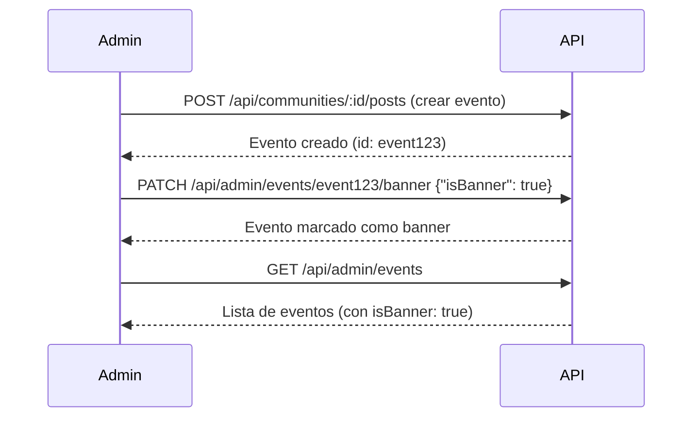
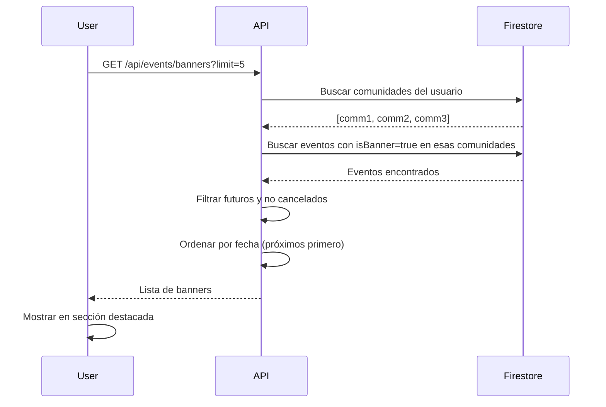

# API de Banners para Eventos

## 📋 Índice
- [Descripción General](#descripción-general)
- [Estructura de Datos](#estructura-de-datos)
- [Endpoints de Admin](#endpoints-de-admin)
- [Endpoints de App](#endpoints-de-app)
- [Flujo de Uso](#flujo-de-uso)
- [Ejemplos](#ejemplos)

---

## 📝 Descripción General

El sistema de banners permite a los administradores destacar eventos importantes en la aplicación. Los eventos marcados como banner aparecen en una sección especial del app, dándoles mayor visibilidad.

### Características

- ✅ **Solo Admin**: Solo administradores pueden marcar/desmarcar eventos como banner
- 🎯 **Eventos Futuros**: Solo eventos futuros y no cancelados aparecen como banner
- 🏘️ **Por Comunidad**: Los usuarios solo ven banners de sus comunidades
- 📅 **Ordenamiento**: Banners se ordenan por fecha del evento (más próximo primero)
- 🚫 **Validación**: No se pueden marcar eventos cancelados como banner

---

## 🗂️ Estructura de Datos

### Campos Agregados a `eventData`

```javascript
{
  eventData: {
    // ... campos existentes ...
    isBanner: boolean,              // Si el evento está marcado como banner
    bannerUpdatedAt: Timestamp,     // Fecha cuando se marcó/desmarcó como banner
    bannerUpdatedBy: string         // UID del admin que lo marcó/desmarcó
  }
}
```

---

## 🔐 Endpoints de Admin

### 1. Marcar/Desmarcar Evento como Banner

**Endpoint:** `PATCH /api/admin/events/:eventId/banner`  
**Auth:** Token + isAdmin  
**Descripción:** Marca o desmarca un evento como banner.

#### Request

**Headers:**
```
Authorization: Bearer <token>
```

**Body:**
```json
{
  "isBanner": true
}
```

| Campo | Tipo | Requerido | Descripción |
|-------|------|-----------|-------------|
| isBanner | boolean | ✅ | true para marcar, false para desmarcar |

#### Response Success (200)

```json
{
  "success": true,
  "message": "Evento marcado como banner",
  "data": {
    "eventId": "event123",
    "isBanner": true
  }
}
```

#### Response Error

**400 - Tipo de dato inválido:**
```json
{
  "success": false,
  "message": "El campo isBanner debe ser un booleano"
}
```

**400 - Evento cancelado:**
```json
{
  "success": false,
  "message": "No se puede marcar como banner un evento cancelado"
}
```

**404 - Evento no encontrado:**
```json
{
  "success": false,
  "message": "Evento no encontrado"
}
```

**400 - No es un evento:**
```json
{
  "success": false,
  "message": "Esta publicación no es un evento"
}
```

---

### 2. Listar Eventos (Admin)

**Endpoint:** `GET /api/admin/events`  
**Auth:** Token + isAdmin

Los eventos ahora incluyen el campo `isBanner`:

```json
{
  "success": true,
  "data": [
    {
      "id": "event123",
      "title": "Taller de Lactancia",
      "isBanner": true,  // ⬅️ NUEVO CAMPO
      "status": "active",
      "eventDate": "2026-02-15T10:00:00Z",
      // ... otros campos ...
    }
  ]
}
```

---

### 3. Detalle de Evento (Admin)

**Endpoint:** `GET /api/admin/events/:eventId`  
**Auth:** Token + isAdmin

El detalle ahora incluye información del banner:

```json
{
  "success": true,
  "data": {
    "id": "event123",
    "eventData": {
      "title": "Taller de Lactancia",
      "isBanner": true,              // ⬅️ Estado de banner
      "bannerUpdatedAt": "2026-02-05T15:30:00Z",  // ⬅️ Cuándo se marcó
      // ... otros campos ...
    }
  }
}
```

---

## 📱 Endpoints de App

### Obtener Eventos Banner

**Endpoint:** `GET /api/events/banners`  
**Auth:** Token (usuario)  
**Descripción:** Obtiene eventos marcados como banner de las comunidades del usuario.

#### Request

**Headers:**
```
Authorization: Bearer <token>
```

**Query Parameters:**

| Parámetro | Tipo | Por Defecto | Descripción |
|-----------|------|-------------|-------------|
| limit | integer | 5 | Cantidad máxima de banners a retornar |

**Ejemplo:**
```
GET /api/events/banners?limit=3
```

#### Response Success (200)

```json
{
  "success": true,
  "data": [
    {
      "id": "event123",
      "title": "Taller de Lactancia Materna",
      "description": "Aprende las mejores técnicas de lactancia...",
      "imageUrl": "https://storage.googleapis.com/...",
      "eventDate": "2026-02-15T10:00:00Z",
      "eventEndDate": "2026-02-15T12:00:00Z",
      "location": {
        "name": "Centro Comunitario",
        "address": "Calle Principal 123",
        "city": "Ciudad de México"
      },
      "communityId": "comm456",
      "communityName": "Mamás Primerizas CDMX",
      "authorId": "user789",
      "authorName": "Dra. María López",
      "attendeeCount": 25,
      "maxAttendees": 50,
      "isUserAttending": false,
      "likeCount": 42,
      "commentCount": 8,
      "createdAt": "2026-02-01T10:00:00Z",
      "bannerUpdatedAt": "2026-02-05T15:30:00Z"
    }
  ]
}
```

#### Características del Endpoint

1. **Solo Eventos Futuros**: Solo retorna eventos cuya fecha aún no ha pasado
2. **No Cancelados**: Excluye eventos con status "cancelled"
3. **Solo Comunidades del Usuario**: Filtra por comunidades donde el usuario es miembro
4. **Ordenado por Fecha**: Los eventos más próximos aparecen primero
5. **Información Completa**: Incluye datos del evento, comunidad y autor
6. **Estado de Asistencia**: Indica si el usuario ya confirmó asistencia

#### Response - Sin Banners

```json
{
  "success": true,
  "data": []
}
```

---

## 🔄 Flujo de Uso

### Flujo de Admin



### Flujo de Usuario en App



---

## 💡 Ejemplos

### Ejemplo 1: Marcar Evento como Banner

**Request:**
```bash
curl -X PATCH https://api.mumpa.com/api/admin/events/event123/banner \
  -H "Authorization: Bearer <admin-token>" \
  -H "Content-Type: application/json" \
  -d '{"isBanner": true}'
```

**Response:**
```json
{
  "success": true,
  "message": "Evento marcado como banner",
  "data": {
    "eventId": "event123",
    "isBanner": true
  }
}
```

---

### Ejemplo 2: Desmarcar Evento como Banner

**Request:**
```bash
curl -X PATCH https://api.mumpa.com/api/admin/events/event123/banner \
  -H "Authorization: Bearer <admin-token>" \
  -H "Content-Type: application/json" \
  -d '{"isBanner": false}'
```

**Response:**
```json
{
  "success": true,
  "message": "Banner removido del evento",
  "data": {
    "eventId": "event123",
    "isBanner": false
  }
}
```

---

### Ejemplo 3: Obtener Banners en la App

**Request:**
```bash
curl https://api.mumpa.com/api/events/banners?limit=3 \
  -H "Authorization: Bearer <user-token>"
```

**Response:**
```json
{
  "success": true,
  "data": [
    {
      "id": "event123",
      "title": "Taller de Lactancia",
      "description": "Técnicas y consejos...",
      "imageUrl": "https://...",
      "eventDate": "2026-02-10T10:00:00Z",
      "communityName": "Mamás Primerizas CDMX",
      "attendeeCount": 25,
      "maxAttendees": 50,
      "isUserAttending": false
    },
    {
      "id": "event456",
      "title": "Grupo de Apoyo Postparto",
      "description": "Comparte experiencias...",
      "imageUrl": "https://...",
      "eventDate": "2026-02-12T16:00:00Z",
      "communityName": "Postparto México",
      "attendeeCount": 15,
      "maxAttendees": 30,
      "isUserAttending": true
    }
  ]
}
```

---

### Ejemplo 4: Listar Eventos con Estado de Banner (Admin)

**Request:**
```bash
curl https://api.mumpa.com/api/admin/events?page=1&limit=10 \
  -H "Authorization: Bearer <admin-token>"
```

**Response:**
```json
{
  "success": true,
  "data": [
    {
      "id": "event123",
      "title": "Taller de Lactancia",
      "isBanner": true,    // ⬅️ Marcado como banner
      "status": "active",
      "attendeeCount": 25,
      // ...
    },
    {
      "id": "event456",
      "title": "Yoga para Embarazadas",
      "isBanner": false,   // ⬅️ No es banner
      "status": "active",
      "attendeeCount": 12,
      // ...
    }
  ],
  "stats": {
    "total": 45,
    "upcoming": 32
  },
  "pagination": {
    "total": 45,
    "page": 1,
    "limit": 10,
    "totalPages": 5
  }
}
```

---

## 🎨 Integración en el Frontend

### Mostrar Banners en la App

```javascript
// Obtener banners
const fetchBanners = async () => {
  const response = await fetch('/api/events/banners?limit=5', {
    headers: {
      'Authorization': `Bearer ${userToken}`
    }
  });
  
  const result = await response.json();
  
  if (result.success) {
    setBanners(result.data);
  }
};

// Renderizar banners
{banners.map(banner => (
  <BannerCard
    key={banner.id}
    title={banner.title}
    image={banner.imageUrl}
    date={banner.eventDate}
    community={banner.communityName}
    attendees={banner.attendeeCount}
    maxAttendees={banner.maxAttendees}
    isAttending={banner.isUserAttending}
    onPress={() => navigateToEvent(banner.id)}
  />
))}
```

---

### Toggle Banner en Admin Dashboard

```javascript
// Marcar/desmarcar evento como banner
const toggleBanner = async (eventId, currentState) => {
  try {
    const response = await fetch(`/api/admin/events/${eventId}/banner`, {
      method: 'PATCH',
      headers: {
        'Authorization': `Bearer ${adminToken}`,
        'Content-Type': 'application/json'
      },
      body: JSON.stringify({ isBanner: !currentState })
    });
    
    const result = await response.json();
    
    if (result.success) {
      showNotification(result.message);
      refreshEvents();
    }
  } catch (error) {
    showError('Error actualizando banner');
  }
};

// Componente de admin
<Switch
  value={event.isBanner}
  onValueChange={() => toggleBanner(event.id, event.isBanner)}
  label="Mostrar como banner"
/>
```

---

## 🔍 Validaciones

### Backend Validations

1. **Solo Admin**: Endpoint de marcar banner requiere middleware `isAdmin`
2. **isBanner es booleano**: Valida que el valor sea true o false
3. **Evento existe**: Verifica que el evento exista en Firestore
4. **Es un evento**: Confirma que postType sea 'event'
5. **No cancelado**: No permite marcar eventos cancelados como banner

### Filtros Automáticos

El endpoint `/api/events/banners` aplica estos filtros:

1. ✅ Solo eventos con `isBanner: true`
2. ✅ Solo eventos futuros (eventDate >= now)
3. ✅ Solo eventos no cancelados (status !== 'cancelled')
4. ✅ Solo de comunidades donde el usuario es miembro
5. ✅ Ordenados por fecha del evento (próximos primero)

---

## 📊 Casos de Uso

### 1. Destacar Evento Importante
```
Admin crea evento especial → Lo marca como banner → 
Usuarios ven el banner en pantalla principal
```

### 2. Promover Evento con Pocos Asistentes
```
Admin ve evento con baja asistencia → Lo marca como banner → 
Mayor visibilidad → Aumenta registro
```

### 3. Remover Banner de Evento Lleno
```
Evento alcanza capacidad máxima → Admin desmarca banner → 
Libera espacio para otros eventos
```

### 4. Banner Automático se Oculta al Pasar
```
Evento marcado como banner → Fecha del evento pasa → 
Automáticamente deja de aparecer en banners
```

---

## 🚨 Errores Comunes

### Error 1: Intentar marcar evento cancelado

**Request:**
```json
{
  "isBanner": true
}
```

**Response:**
```json
{
  "success": false,
  "message": "No se puede marcar como banner un evento cancelado"
}
```

**Solución:** Primero cambiar el status del evento a "active" y luego marcarlo como banner.

---

### Error 2: Valor no booleano

**Request:**
```json
{
  "isBanner": "yes"  // ❌ String en lugar de boolean
}
```

**Response:**
```json
{
  "success": false,
  "message": "El campo isBanner debe ser un booleano"
}
```

**Solución:** Usar `true` o `false` (sin comillas).

---

## 📈 Métricas y Analytics

### Rastrear Views de Banner

**Endpoint:** `POST /api/banners/:id/view`

**Descripción:** Incrementa el contador de vistas cuando un usuario ve un banner (evento-banner o banner general).

**Request:**
```http
POST /api/banners/tyI7V1o87q7b1RQdh7as/view
```

**Response:**
```json
{
  "success": true,
  "message": "Vista registrada"
}
```

**Notas:**
- ✅ Funciona tanto para banners generales como eventos marcados como banner
- ✅ Incrementa automáticamente el campo `bannerViews` en el evento
- ✅ No requiere autenticación (público)

---

### Rastrear Clicks de Banner

**Endpoint:** `POST /api/banners/:id/click`

**Descripción:** Incrementa el contador de clicks cuando un usuario hace click en un banner.

**Request:**
```http
POST /api/banners/tyI7V1o87q7b1RQdh7as/click
```

**Response:**
```json
{
  "success": true,
  "message": "Click registrado"
}
```

**Notas:**
- ✅ Funciona tanto para banners generales como eventos marcados como banner
- ✅ Incrementa automáticamente el campo `bannerClicks` en el evento
- ✅ No requiere autenticación (público)

---

### Datos que puedes rastrear:

1. **Eventos marcados como banner**: Contar cuántos eventos tienen `isBanner: true`
2. **Efectividad**: Comparar asistencia antes/después de marcar como banner
3. **Engagement**: Medir clicks en banners vs posts normales
4. **Timing**: Ver cuánto tiempo antes del evento se marca como banner
5. **CTR (Click-Through Rate)**: `bannerClicks / bannerViews * 100`

---

## 🎯 Mejoras Futuras

### Posibles Features

1. **Banner Priority**: Orden personalizado de banners
2. **Auto-Banner**: Marcar automáticamente eventos con criterios específicos
3. **Banner Analytics**: Dashboard de rendimiento de banners
4. **Scheduled Banner**: Programar cuándo un evento se muestra como banner
5. **A/B Testing**: Probar diferentes imágenes/textos de banner
6. **Banner Slots**: Limitar cantidad de banners activos simultáneamente

---

## 📝 Resumen

### ✅ Implementado

- ✅ Campo `isBanner` en eventData
- ✅ Endpoint admin para marcar/desmarcar banner
- ✅ Endpoint app para obtener banners
- ✅ Filtrado automático (futuros, no cancelados, por comunidad)
- ✅ Validaciones completas
- ✅ Ordenamiento por fecha
- ✅ Información completa en respuesta

### 🎨 Frontend To-Do

- [ ] Sección de banners en pantalla principal
- [ ] Toggle de banner en admin dashboard
- [ ] Indicador visual de banner en lista de eventos
- [ ] Analytics de clicks en banners
- [ ] Diseño de tarjetas de banner

---

**Última actualización:** 2026-02-05  
**Versión API:** 1.0
