# 🗑️ API - Eliminar Post/Evento

## Endpoint

```http
DELETE /api/posts/:postId
```

## Descripción

Permite a un usuario eliminar su propia publicación o evento de una comunidad. Solo el autor del post puede eliminarlo.

---

## Headers Requeridos

```http
Authorization: Bearer {JWT_TOKEN}
```

---

## Parámetros de Ruta

- **`postId`** (string, requerido): ID del post o evento a eliminar

---

## Respuesta Exitosa (200)

```json
{
  "success": true,
  "message": "Publicación eliminada exitosamente"
}
```

---

## Errores

### 401 Unauthorized
Token no válido o faltante.

```json
{
  "success": false,
  "message": "Token no válido"
}
```

### 403 Forbidden
El usuario no es el autor del post.

```json
{
  "success": false,
  "message": "No tienes permiso para eliminar esta publicación"
}
```

### 404 Not Found
El post no existe.

```json
{
  "success": false,
  "message": "Publicación no encontrada"
}
```

### 500 Internal Server Error
Error del servidor.

```json
{
  "success": false,
  "message": "Error eliminando publicación",
  "error": "..."
}
```

---

## Comportamiento

1. **Verifica que el post existe** en la colección `posts`
2. **Verifica que el usuario es el autor** del post (`postData.authorId === uid`)
3. **Elimina el post** de Firestore
4. **Actualiza el contador** de posts en la comunidad (decrementa `postCount`)

---

## Ejemplo de Uso

### JavaScript/TypeScript

```typescript
const deletePost = async (postId: string) => {
  try {
    const token = await getAuthToken();
    
    const response = await fetch(`https://api.munpa.online/api/posts/${postId}`, {
      method: 'DELETE',
      headers: {
        'Authorization': `Bearer ${token}`
      }
    });

    const data = await response.json();

    if (data.success) {
      console.log('Post eliminado:', data.message);
      // Actualizar UI, navegar, etc.
    } else {
      console.error('Error:', data.message);
    }

  } catch (error) {
    console.error('Error eliminando post:', error);
  }
};

// Uso
deletePost('tyI7V1o87q7b1RQdh7as');
```

### React Native (Expo)

```typescript
import { Alert } from 'react-native';

const handleDeletePost = async (postId: string) => {
  // Confirmar con el usuario
  Alert.alert(
    '¿Eliminar publicación?',
    'Esta acción no se puede deshacer',
    [
      {
        text: 'Cancelar',
        style: 'cancel'
      },
      {
        text: 'Eliminar',
        style: 'destructive',
        onPress: async () => {
          try {
            const token = await getIdToken();
            
            const response = await fetch(
              `https://api.munpa.online/api/posts/${postId}`,
              {
                method: 'DELETE',
                headers: {
                  'Authorization': `Bearer ${token}`
                }
              }
            );

            const data = await response.json();

            if (data.success) {
              Alert.alert('Éxito', 'Publicación eliminada');
              navigation.goBack();
            } else {
              Alert.alert('Error', data.message);
            }

          } catch (error) {
            Alert.alert('Error', 'No se pudo eliminar la publicación');
          }
        }
      }
    ]
  );
};
```

### Axios

```typescript
import axios from 'axios';

const deletePost = async (postId: string) => {
  try {
    const token = await getAuthToken();
    
    const response = await axios.delete(
      `https://api.munpa.online/api/posts/${postId}`,
      {
        headers: {
          'Authorization': `Bearer ${token}`
        }
      }
    );

    console.log('Post eliminado:', response.data.message);
    return response.data;

  } catch (error) {
    if (error.response?.status === 403) {
      console.error('No tienes permiso para eliminar este post');
    } else if (error.response?.status === 404) {
      console.error('El post no existe');
    } else {
      console.error('Error:', error.response?.data?.message);
    }
    throw error;
  }
};
```

---

## Componente React Native Completo

```typescript
import React from 'react';
import { View, Text, TouchableOpacity, Alert, StyleSheet } from 'react-native';
import { Ionicons } from '@expo/vector-icons';

interface PostActionsProps {
  post: {
    id: string;
    authorId: string;
    content: string;
    postType?: 'normal' | 'event';
  };
  currentUserId: string;
  onPostDeleted?: () => void;
}

const PostActions: React.FC<PostActionsProps> = ({ 
  post, 
  currentUserId, 
  onPostDeleted 
}) => {
  const isAuthor = post.authorId === currentUserId;

  const handleDelete = () => {
    Alert.alert(
      'Eliminar publicación',
      post.postType === 'event' 
        ? '¿Estás seguro de eliminar este evento? Los asistentes serán notificados.'
        : '¿Estás seguro de eliminar esta publicación?',
      [
        {
          text: 'Cancelar',
          style: 'cancel'
        },
        {
          text: 'Eliminar',
          style: 'destructive',
          onPress: async () => {
            try {
              const token = await getIdToken();
              
              const response = await fetch(
                `https://api.munpa.online/api/posts/${post.id}`,
                {
                  method: 'DELETE',
                  headers: {
                    'Authorization': `Bearer ${token}`
                  }
                }
              );

              const data = await response.json();

              if (data.success) {
                Alert.alert('Éxito', 'Publicación eliminada');
                onPostDeleted?.();
              } else {
                Alert.alert('Error', data.message);
              }

            } catch (error) {
              Alert.alert(
                'Error', 
                'No se pudo eliminar la publicación. Intenta de nuevo.'
              );
            }
          }
        }
      ]
    );
  };

  if (!isAuthor) return null;

  return (
    <View style={styles.container}>
      <TouchableOpacity 
        style={styles.deleteButton}
        onPress={handleDelete}
      >
        <Ionicons name="trash-outline" size={20} color="#EF4444" />
        <Text style={styles.deleteText}>Eliminar</Text>
      </TouchableOpacity>
    </View>
  );
};

const styles = StyleSheet.create({
  container: {
    flexDirection: 'row',
    justifyContent: 'flex-end',
    paddingHorizontal: 16,
    paddingVertical: 8,
  },
  deleteButton: {
    flexDirection: 'row',
    alignItems: 'center',
    gap: 4,
    paddingVertical: 8,
    paddingHorizontal: 12,
    borderRadius: 8,
    backgroundColor: '#FEE2E2',
  },
  deleteText: {
    color: '#EF4444',
    fontSize: 14,
    fontWeight: '600',
  },
});

export default PostActions;
```

---

## Notas Importantes

### Seguridad

- ✅ **Solo el autor puede eliminar** su propia publicación
- ✅ El endpoint verifica `postData.authorId === req.user.uid`
- ✅ Los admins deben usar `/api/admin/posts/:postId` (no requiere verificación de autor)

### Impacto en Datos

- 🗑️ **Elimina el documento** completo de la colección `posts`
- 📉 **Decrementa el contador** `postCount` en la comunidad
- ⚠️ **No elimina automáticamente**:
  - Comentarios del post
  - Notificaciones relacionadas
  - Imágenes de Firebase Storage

### Eventos

- Si el post es un evento (`postType: 'event'`), se elimina:
  - Lista de asistentes
  - Lista de espera
  - Check-ins
  - Datos del evento

### Recomendaciones UX

1. **Confirmar antes de eliminar** con `Alert.alert()`
2. **Mostrar loader** durante la eliminación
3. **Navegar atrás** después de eliminar
4. **Actualizar lista** de posts en la UI
5. **Solo mostrar opción** al autor del post

---

## Testing

### Curl

```bash
# Eliminar un post
curl -X DELETE https://api.munpa.online/api/posts/tyI7V1o87q7b1RQdh7as \
  -H "Authorization: Bearer YOUR_TOKEN_HERE"
```

### Postman

1. Método: `DELETE`
2. URL: `https://api.munpa.online/api/posts/:postId`
3. Headers:
   - `Authorization`: `Bearer YOUR_TOKEN_HERE`
4. Send

---

## Flujo Completo

```mermaid
sequenceDiagram
    participant User
    participant App
    participant API
    participant Firestore

    User->>App: Click "Eliminar"
    App->>User: Confirmar acción
    User->>App: Confirmar
    App->>API: DELETE /api/posts/:postId
    API->>Firestore: Obtener post
    Firestore-->>API: Post data
    API->>API: Verificar authorId
    alt Es el autor
        API->>Firestore: Eliminar post
        API->>Firestore: Decrementar postCount
        Firestore-->>API: OK
        API-->>App: { success: true }
        App-->>User: "Publicación eliminada"
    else No es el autor
        API-->>App: 403 Forbidden
        App-->>User: "No tienes permiso"
    end
```



---

## Estado

- ✅ **Implementado:** 7 Feb 2026
- ✅ **Desplegado:** Producción
- ✅ **Probado:** Sí
- 🔐 **Requiere Auth:** Sí
- 🛡️ **Verificación de Autor:** Sí

---

## Ver También

- `DELETE /api/admin/posts/:postId` - Eliminar cualquier post (solo admin)
- `POST /api/communities/:communityId/posts` - Crear post
- `PUT /api/admin/posts/:postId` - Editar post (admin)
