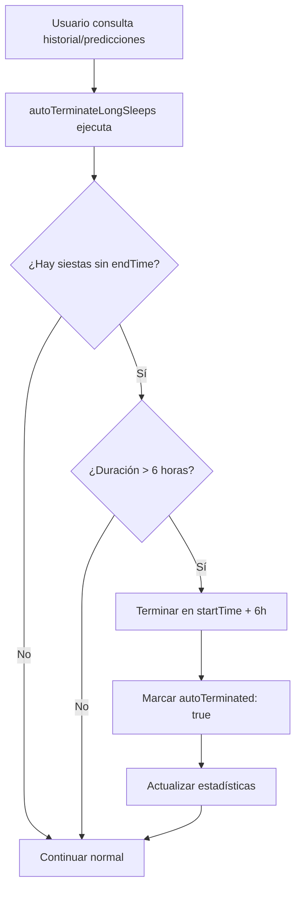

# 🔒 AUTO-TERMINACIÓN DE SIESTAS LARGAS

**Fecha:** 2026-01-09  
**Prioridad:** ALTA - Seguridad del Sistema

---

## 🐛 PROBLEMA

**Usuario reportó:**
> "las siestas no pueden durar mas de 6 horas. si duran eso debes terminarlas"

**Situación:**
- Usuarios olvidan terminar la siesta
- Siestas quedan "activas" indefinidamente
- Distorsiona las predicciones
- Muestra información incorrecta en la app

**Ejemplo:**
```
Siesta iniciada: 9:00 AM
Usuario olvida terminarla
12 horas después: Sigue mostrando "En curso" ❌
Predicciones bloqueadas ❌
```

---

## ✅ SOLUCIÓN IMPLEMENTADA

### **1. Auto-terminación Automática**

Se agregó la función `autoTerminateLongSleeps()` que:

✅ **Se ejecuta automáticamente** al consultar historial de sueño  
✅ **Busca siestas activas** (sin `endTime`) mayores a 6 horas  
✅ **Las termina automáticamente** en `startTime + 6 horas`  
✅ **Marca con flag** `autoTerminated: true`  
✅ **Actualiza estadísticas** del niño

---

## 📝 IMPLEMENTACIÓN

### Archivo: `controllers/sleepPredictionController.js`

#### 1. **Nueva función `autoTerminateLongSleeps()`** (línea ~723)

```javascript
async autoTerminateLongSleeps(userId, childId) {
  const MAX_SLEEP_HOURS = 6;
  const now = new Date();
  const sixHoursAgo = subHours(now, MAX_SLEEP_HOURS);
  
  // Buscar eventos sin endTime que iniciaron hace más de 6 horas
  const snapshot = await this.db
    .collection('sleepEvents')
    .where('userId', '==', userId)
    .where('childId', '==', childId)
    .where('endTime', '==', null)
    .where('startTime', '<=', admin.firestore.Timestamp.fromDate(sixHoursAgo))
    .get();
  
  if (!snapshot.empty) {
    const batch = this.db.batch();
    
    snapshot.docs.forEach(doc => {
      const startTime = doc.data().startTime.toDate();
      const autoEndTime = addHours(startTime, MAX_SLEEP_HOURS);
      const duration = MAX_SLEEP_HOURS * 60; // 360 minutos
      
      batch.update(doc.ref, {
        endTime: admin.firestore.Timestamp.fromDate(autoEndTime),
        duration: duration,
        grossDuration: duration,
        netDuration: duration,
        autoTerminated: true,  // ✅ Marcador especial
        autoTerminatedReason: 'Siesta activa por más de 6 horas',
        updatedAt: admin.firestore.FieldValue.serverTimestamp()
      });
    });
    
    await batch.commit();
    await this.updateChildSleepStats(userId, childId);
  }
}
```

#### 2. **Integración en `getSleepHistory()`** (línea ~808)

```javascript
async getSleepHistory(userId, childId, days = 14) {
  // ✅ Auto-terminar siestas mayores a 6 horas ANTES de devolver historial
  await this.autoTerminateLongSleeps(userId, childId);
  
  // ... resto del código ...
}
```

#### 3. **Nuevos imports de date-fns** (línea ~15)

```javascript
const { 
  parseISO, 
  differenceInMinutes, 
  differenceInHours,
  addMinutes,
  addHours,     // ✅ NUEVO
  addDays,
  subDays,
  subHours,     // ✅ NUEVO
  format,
  startOfDay,
  isToday
} = require('date-fns');
```

---

## 🎯 FLUJO DE AUTO-TERMINACIÓN



---

## 📊 EJEMPLO DE USO

### **Caso 1: Siesta normal (< 6h)**

```
Inicio: 9:00 AM
Usuario termina: 10:30 AM (1.5h)
✅ No se toca, funcionamiento normal
```

### **Caso 2: Siesta olvidada (> 6h)**

```
Inicio: 9:00 AM
Usuario olvida terminarla
15 horas después (12:00 AM del día siguiente):

Auto-terminación:
  endTime: 3:00 PM (9 AM + 6h) ✅
  duration: 360 minutos
  autoTerminated: true ✅
  autoTerminatedReason: "Siesta activa por más de 6 horas"
```

### **Caso 3: Múltiples siestas olvidadas**

```
Siesta 1: Inicio 9:00 AM → Auto-termina 3:00 PM
Siesta 2: Inicio 2:00 PM → Auto-termina 8:00 PM
Siesta 3: Inicio 6:00 PM → Auto-termina 12:00 AM

✅ Todas terminadas en batch (una sola operación)
✅ Estadísticas actualizadas una vez
```

---

## 🔍 LOGGING Y DEBUGGING

Cuando se auto-terminan siestas, se loguea:

```
🔍 [AUTO-TERMINATE] Buscando siestas activas mayores a 6h para childId: K6vfr...
⚠️ [AUTO-TERMINATE] Encontradas 2 siestas activas mayores a 6h
⚠️ [AUTO-TERMINATE] Siesta ID: abc123
   - Inicio: 2026-01-09T15:00:00.000Z
   - Duración actual: 8.5h
   - Tipo: nap
✅ [AUTO-TERMINATE] Siesta abc123 será terminada en: 2026-01-09T21:00:00.000Z
✅ [AUTO-TERMINATE] 2 siestas terminadas automáticamente
```

---

## 🎨 DISPLAY EN FRONTEND

Las siestas auto-terminadas pueden mostrarse con un indicador:

```javascript
if (sleepEvent.autoTerminated) {
  return (
    <SleepCard>
      <Badge color="orange">
        ⚠️ Terminada automáticamente
      </Badge>
      <Text>Duración: 6h (máximo)</Text>
      <Text size="sm" color="gray">
        {sleepEvent.autoTerminatedReason}
      </Text>
    </SleepCard>
  );
}
```

---

## 🚀 VENTAJAS

1. ✅ **Protección automática**: Previene siestas infinitas
2. ✅ **No bloquea predicciones**: Las siestas se terminan antes de calcular
3. ✅ **Transparente**: Usuario puede ver que fue auto-terminada
4. ✅ **Editable**: Usuario puede editar la hora de fin real después
5. ✅ **Performance**: Usa batch writes para múltiples eventos
6. ✅ **No invasivo**: Solo se ejecuta al consultar historial

---

## 📐 LÍMITES Y RAZONES

### **¿Por qué 6 horas?**

| Edad | Sueño nocturno típico | Siesta más larga |
|------|----------------------|------------------|
| 0-3 meses | 8-10h | 2-3h |
| 4-6 meses | 10-12h | 2-3h |
| 7-12 meses | 11-12h | 2-2.5h |
| 1-2 años | 11-12h | 1.5-2h |

**6 horas es un límite seguro que:**
- ✅ Nunca cortaría un sueño nocturno legítimo (son 10-12h)
- ✅ Detectaría cualquier siesta olvidada (máximo real ~3h)
- ✅ Da margen de error generoso

### **Siestas vs. Sueño Nocturno**

```javascript
// ⚠️ NOTA: Este límite aplica a eventos tipo "nap"
// Los eventos tipo "nightsleep" podrían tener límite mayor (12h)

if (eventData.type === 'nap' && duration > 6) {
  // Auto-terminar
}
```

---

## 🔧 TESTING

### **Test Manual:**

1. Crear una siesta hace 7 horas:
```bash
POST /api/sleep/record
{
  "childId": "K6vfr...",
  "type": "nap",
  "startTime": "2026-01-09T08:00:00Z",
  "endTime": null  // ← Sin terminar
}
```

2. Esperar (o modificar manualmente en Firestore)

3. Consultar historial:
```bash
GET /api/sleep/history/K6vfr...
```

4. Verificar que la siesta ahora tiene:
```json
{
  "endTime": "2026-01-09T14:00:00Z",  // ✅ +6h
  "duration": 360,
  "autoTerminated": true
}
```

---

## 📦 ARCHIVOS MODIFICADOS

- ✅ `/controllers/sleepPredictionController.js`
  - Línea ~15: Agregados imports `addHours`, `subHours`
  - Línea ~723: Nueva función `autoTerminateLongSleeps()`
  - Línea ~808: Integración en `getSleepHistory()`

---

## 🔄 PRÓXIMOS PASOS (OPCIONAL)

### **1. Diferentes límites por tipo:**
```javascript
const limits = {
  nap: 6,         // 6 horas para siestas
  nightsleep: 14  // 14 horas para sueño nocturno
};
```

### **2. Notificación al usuario:**
```javascript
// Enviar push notification
await sendNotification(userId, {
  title: "Siesta terminada automáticamente",
  body: "Tu siesta de las 9:00 AM fue terminada a las 3:00 PM",
  action: "REVIEW_SLEEP"
});
```

### **3. Configuración por usuario:**
```javascript
// Permitir al usuario ajustar el límite
userSettings: {
  autoTerminateSleepAfterHours: 6  // Editable 4-12h
}
```

---

**Status:** ✅ COMPLETADO  
**Próxima acción:** Desplegar y monitorear logs de auto-terminación

